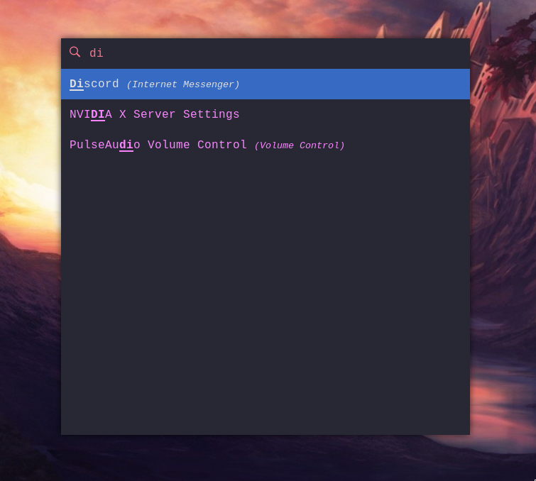

# ~/.dotfiles

Dotfiles are those files and directories found in Unix-based operating systems
encharged of saving customization settings of user applications. As the name
implies, these dotfiles usually start with a `.` in their names.

These are my personal dotfiles to keep them archived in case I ~~screw up my
system~~ switch computers and need to get things settled quickly.

## Software

#### Distro

[Gentoo](https://www.gentoo.org)

#### Shell

* [Alacritty](https://github.com/alacritty/alacritty)

* [zsh](https://github.com/zsh-users/zsh) with [Oh My Zsh](https://github.com/ohmyzsh/ohmyzsh)

* [Powerlevel10k](https://github.com/romkatv/powerlevel10k)

* [Nerd Fonts](https://github.com/ryanoasis/nerd-fonts), I use Hack

#### Window Manager

* [i3-gaps](https://github.com/Airblader/i3)

* [polybar](https://github.com/polybar/polybar)

* [dunst](https://github.com/dunst-project/dunst)

* [compton/picom](https://github.com/yshui/picom)

* [rofi](https://github.com/DaveDavenport/rofi)

* [feh](https://github.com/derf/feh)

* fontconfig

#### Other

* [spacemacs](https://github.com/syl20bnr/spacemacs) (primary)

* [Vim](https://github.com/vim/vim)

* [LightDM](https://github.com/canonical/lightdm) with lightdm-gtk-greeter

## Installation

* Clone this into your (empty) home directory on a fresh install

* Cherry-pick the ones you like

## Screenshots

#### Desktop:

#### Terminal:

#### Spacemacs:

#### rofi:

